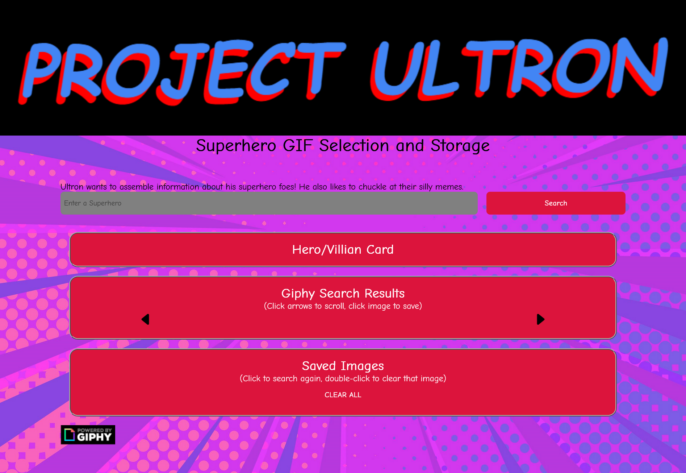

# Project Ultron

## Description
This product is gives superhero stats and pulls gifs to save for later.

## Table of Contents
- [Installation](#installation)
- [Usage](#usage)
- [Contributing](#contributing)
- [License](#license)

## Installation
No Installation necessary just open in the browser to bring back your goofy gifs and super hero stats.

## Usage
In the search bar type out your super hero,  after 4 letters have been type it will fetch and populate buttons for each return of those characters.  Clicking on one of the hero buttons will populate a card with that heros name, an image and stats provided by super hero api.  Then it will pull some gifs for that superhero and you can scroll through them and if you find one you like you, just click it once to save that gif!
In the saved gif section if you want to see that hero and more gifs for that hero just click it once again and it will pull the hero up.  If you decide you dislike that gif and are sick of looking at it, double-click to get rid of it. (This feature is subject to change due to functionality).

## Contributing
TRalston511      :  https://github.com/TRalston511

clstevenson     :  https://github.com/clstevenson

nicholasstacy89 :  https://github.com/nicholasstacy89

superheroapi

giphy

Repo : https://github.com/nicholasstacy89/Project-Ultron

Live:  https://nicholasstacy89.github.io/Project-Ultron/

## License
A Project1-Group2 production.
